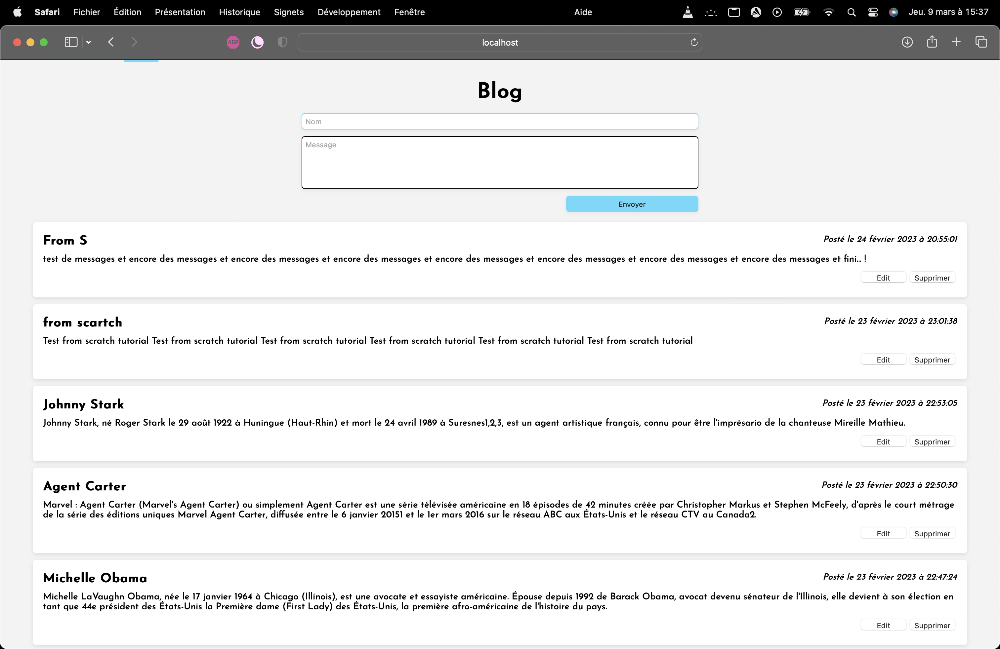

# React Flag API/Blog  Version 2 #

This project use the version 18 of React JS

I call an API for générate the flags in : https://restcountries.com/v3.1/all 

I have include a CRUD with a JSon Server NoSQL to call my database for read, create, update and delete all posts.
All API Call use Axios to work.

I have use component stylised with Sass.

This project was realised by Spyros Zaboukis with a Tutorial from the cours of "From Scrath".
